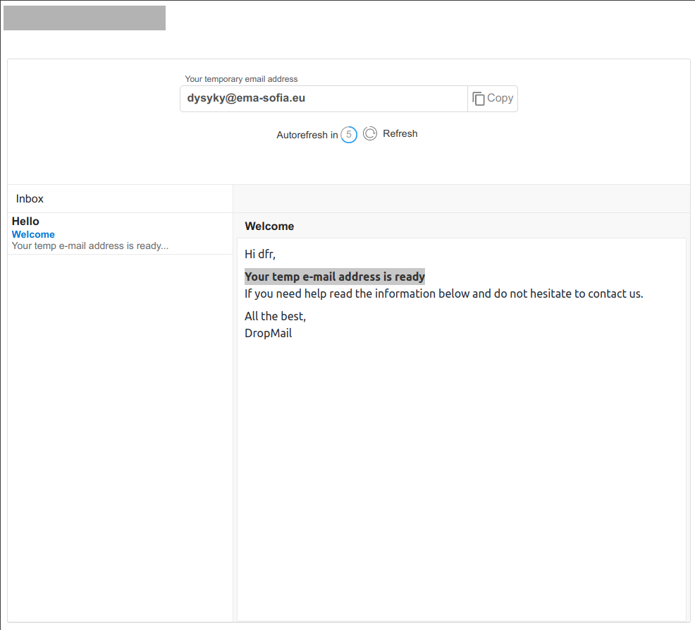

>This is a challenge by [Coodesh](https://coodesh.com/)

# Dropmail

## Case

Sites e serviços online geralmente exigem um endereço de e-mail válido para registrar, acessar ou receber conteúdo protegido, etc. No entanto, o problema é que alguns desses sites podem usar nossos endereços de e-mail para enviar mensagens indesejadas. As pessoas não querem se preocupar mais com spam, propagandas no email, hackers e ataques de robôs.

Uma boa maneira de lidar com isso é usar um endereço de e-mail temporário se você não tiver certeza de que este site é absolutamente confiável e confiável. Dessa forma, você pode manter seus e-mails longe de spam e proteger sua privacidade. Sua tarefa para esse case será desenvolver uma aplicação que consuma uma API de email temporário para que os usuários possam utilizar serviços sem expor seu email real, seguindo os requisitos propostos neste desafio.



## Tecnologias utilizadas

- React + Typescript
- Redux
- Graphql
- Material UI
- Tailwind

## Pré Requisitos

```
- Node
- Npm
- Git 
```

## Clone o repositório 

```git
git clone https://github.com/MateusAbu/dropmail.git
```

## Variáveis de ambiente

### Terá uma variável que precisa ser adicionada, e você pode encontrar a mesma no site https://cors.sh/.

### Ao acessar coloque seu email e clique no botão Send me an API Key e pegue no seu email a chave em questão.

### Para rodar esse projeto, você vai precisar adicionar a variável de ambiente "apiKey" ao seu arquivo index.tsx 

` apiKey='temp_token' `


## Como rodar o projeto Localmente

```
npm install  //Para instalar as dependencias necessarias

npm start //Para Iniciar a aplicação que geralmente como padrão estará no link http://localhost:3000/

```